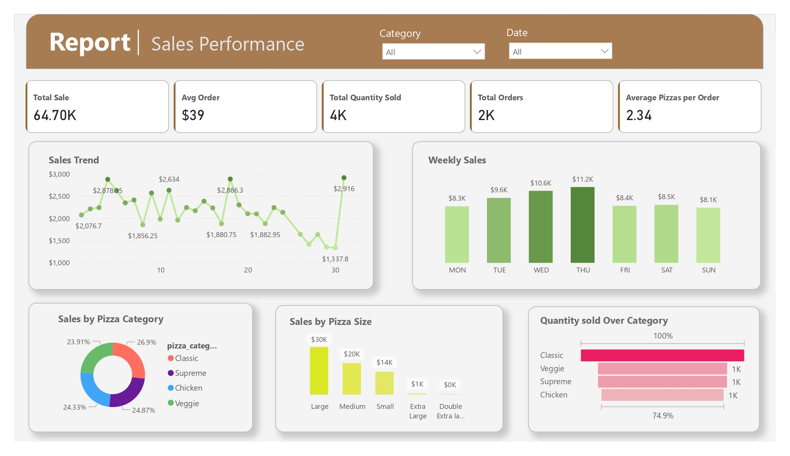

# 🍕 Pizza Shop Sales Analysis – Power BI Report

## 📌 Project Overview

This Power BI report analyzes pizza shop sales data to show KPI'S, Sales trend, weekly performance, sales over category and size.

## 🧰 Tools Used

- **Power BI Desktop** – for data visualization and modeling
- **Power Query Editor** – for data cleaning and preparation
- **DAX (Data Analysis Expressions)** – for calculations and business metrics

## 🔄 Process

### 1. Data Connection
- Connected Power BI with local Mircrosoft SQL server

📊 [Download Source Data](Data/pizza_sales_excel_file.xlsx)

### 2. Data Cleaning
- Employed **Power Query Editor** for e data cleaning

### 3. Data Modeling
Utilized **DAX** to develop custom calculated measures and columns, including:
  - Average pizzas per transaction
  - Revenue metrics (total and average order values)
  - Sales distribution across pizza sizes and categories

 
### 4. Interactive Report Development
- Built **Power BI Report**
- Added interactive filters for analyzing by date and pizza category
 

[Download Dashboard (PDF)](Report/Pizza_Shop.pdf)

[Download Dashboard (.pbix)](Power_BI_report/Pizza_Shop.pbix)

## 🔍 Insights

### 📈 Key Performance Indicators
- **Total Revenue**: $64,700
- **Average Order Size**: $39
- **Average Pizzas per Order**: 2.34
- **Total Orders Processed**: Over 2,000
- **Total Quantity sold**: 4000

### 🍕 Sales by Pizza Category
- **Classic pizzas** are most popular (~27% sales)
- **Supreme**, **Chicken**, and **Veggie** pizzas each represent around 25%
  
➡️ Diverse tastes suggest targeted promotions and menu optimization.

### 📅 Peak Sales Days
- Maximum sales recorded on **Thursday and Friday**
- Lower sales typically seen on **Sunday and Monday**
  
➡️ Effective resource planning during high-demand periods is crucial.

### 📏 Pizza Size Preferences
- **Large pizzas** significantly outsell other sizes
- **Medium and Small pizzas** have steady but lower demand
  
➡️ Prioritize promotions for large pizzas.

## 🚀 Report Usage Guide

1. Open the `.pbix` file with **Power BI Desktop**
   [Download Dashboard (pbix)](Power_BI_report/Pizza_Shop.pbix)
2. Refresh data to view updated insights
3. Use built-in filters (date, category) for deeper exploration

## Bonus
I used SQL quries to cross check calculations with Power BI.  
[Download SQL quries](SQL_Quries/SQL_Quries.docx)

 

📫 [**Questions or Feedback?** Connect on LinkedIn!](https://www.linkedin.com/in/shehrozsarwar)
